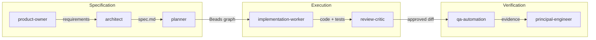

# Agent Cooperation Protocol

> Defines how agents hand off work to each other in the harness.

## Cooperation Flow



## Handoff Contracts

### product-owner → architect
| Field | Value |
|-------|-------|
| Artifact | `.specs/features/[feature]/discovery.md` |
| Contains | Problem statement, user stories, success metrics |
| Acceptance | architect can derive WHEN/THEN/SHALL ACs |
| Escalation | Return to product-owner with clarifying questions |

### architect → planner
| Field | Value |
|-------|-------|
| Artifact | `.specs/features/[feature]/spec.md` |
| Contains | [FEAT]-NN IDs, WHEN/THEN/SHALL ACs, scope estimate |
| Acceptance | Every AC is testable, no TBD markers |
| Escalation | Return to architect for AC refinement |

### planner → implementation-worker
| Field | Value |
|-------|-------|
| Artifact | Beads task graph (bd ready --json) |
| Contains | Tasks with AC IDs, dependencies, estimates |
| Acceptance | Each task has ≤1 AC, clear done criteria |
| Escalation | Return to planner for task decomposition |

### implementation-worker → review-critic
| Field | Value |
|-------|-------|
| Artifact | Git diff + Bead ID |
| Contains | Code, tests, updated Bead status |
| Acceptance | Tests pass, Bead claimed and ready to close |
| Escalation | Return to implementation-worker with findings |

### review-critic → qa-automation
| Field | Value |
|-------|-------|
| Artifact | Approved diff range |
| Contains | APPROVE or PASS-WITH-NITS verdict |
| Acceptance | No BLOCK findings, all CRITICAL addressed |
| Escalation | Return to implementation-worker for fixes |

### qa-automation → principal-engineer
| Field | Value |
|-------|-------|
| Artifact | Test evidence report |
| Contains | AC coverage matrix, test results, browser evidence |
| Acceptance | All ACs have passing tests |
| Escalation | Return to implementation-worker for coverage gaps |

## Escalation Rules

1. **Same-phase escalation**: Agent retries with more context (max 2 attempts)
2. **Cross-phase escalation**: Hand back to previous agent with specific blocker
3. **User escalation**: After 2 cross-phase bounces, ask user for decision

## Beads Integration

Every handoff MUST:
```bash
# Sending agent
bd update <bead-id> --add-label "handoff:ready"
bd update <bead-id> --set-field handoff_artifact="<path>"

# Receiving agent  
bd update <bead-id> --claim
bd update <bead-id> --add-label "handoff:accepted"
```

## Parallel Work Rules

- **Read-only agents** (codebase-researcher, ux-researcher): Can run in parallel
- **Write agents** (implementation-worker, ui-designer): One writer per file/module
- **Review agents** (review-critic, qa-automation): Run after write agents complete

## Anti-patterns

- ❌ Agent starts work without claiming Bead
- ❌ Handoff without artifact path
- ❌ Multiple writers on same file
- ❌ Skipping review phase
- ❌ Closing Bead before verification
