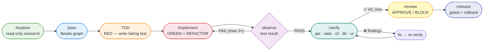
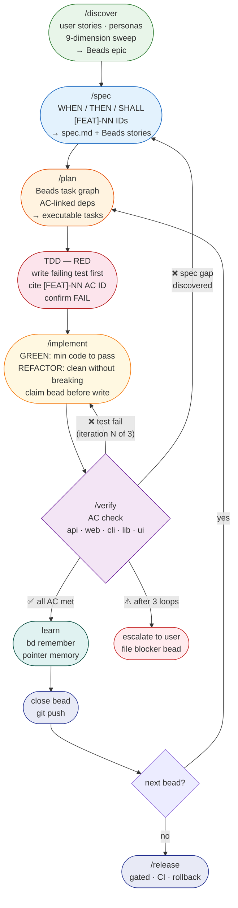

# Agentic Development Harness

A portable Goose + Beads harness for durable agentic software development.

This repository packages reusable **Goose recipes**, **Goose skills**, and **named agents** that make agentic development more reliable, repeatable, and auditable.

## Core idea

- **Goose** is the runtime: extensions, skills, recipes, subrecipes, sessions, and subagents.
- **Beads (`bd`)** is the durable control plane: issues, dependencies, gates, molecules/wisps, memory, and handoffs.
- **SDD** is the development method: spec first, encode work in Beads, implement with tests, review, verify, and remember learnings.

```text
intent → spec → Beads graph → TDD/implementation → review → validation → handoff
```

## Development workflow



## SDD loop — Spec-Driven Development



**Branch at Verify:**

| Result                     | Action                            |
|----------------------------|-----------------------------------|
| ✅ All AC met               | → Learn → close bead → next       |
| ❌ Test failure             | → loop back to Implement (max 3×) |
| ❌ Spec gap                 | → loop back to Spec               |
| ⚠️ 3 iterations unresolved | → escalate to user                |

## Repository layout

```text
.agents/
  agents/                 # Named Goose subagents discoverable by Summon
  skills/                 # Portable Goose skills

.goose/
  recipes/                # Goose recipes and subrecipes
    subrecipes/           # Reusable delegated workflow units
    templates/            # Small helper scripts/templates
```

## Recipes — SDD workflow verbs

| Recipe      | `/slash`     | Purpose                                                                       |
|-------------|--------------|-------------------------------------------------------------------------------|
| `dev`       | `/dev`       | Master entry — routes any task to the right specialist                        |
| `discover`  | `/discover`  | Discovery: user stories, personas, 9-dimension sweep → Beads epic             |
| `spec`      | `/spec`      | Formal spec: WHEN/THEN/SHALL `[FEAT]-NN` IDs → `.specs/` + Beads stories      |
| `explore`   | `/explore`   | Read-only codebase research, blast-radius mapping                             |
| `plan`      | `/plan`      | Spec-anchored Beads task graph, AC-linked dependencies                        |
| `implement` | `/implement` | TDD-first: RED → GREEN → REFACTOR, minimal blast radius                       |
| `review`    | `/review`    | Adaptive code review: PR / feature / security / global / hotfix               |
| `doc-review`| `/doc-review`| Read-only harness documentation review: skills, recipes, AGENTS.md, memory hygiene |
| `verify`    | `/verify`    | Adaptive verification: API (Bruno) / web (Playwright) / CLI / library / UX-UI |
| `design`    | `/design`    | UX research → UI design → WCAG 2.2 AA → browser evidence                      |
| `sdd`       | `/sdd`       | SDD governance: full discover → spec → plan → TDD → implement → verify        |
| `release`   | `/release`   | Gated release with CI waits and rollback plan                                 |
| `remember`  | `/remember`  | Beads memory stewardship: remember / search / recall / forget                 |

**SDD on-ramp:** `/discover` → `/spec` → `/plan` → `/implement` → `/review` → `/verify` → `/release`

<!-- BEGIN GENERATED: skills-table -->
## Skills (18)

| Skill | Purpose |
|-------|---------|
| `agentic-devlopment` | Load for any software development, feature implementation, debugging, code review, release |
| `agentic-ux` | Load when designing, evaluating, or critiquing interfaces for AI-powered or agentic applications. |
| `atomic-design` | Load when building, auditing, or organizing UI components and design systems using Brad Fr |
| `beads` | Load when managing tasks, dependencies, or work state that must persist across sessions. |
| `code-review` | Load when reviewing code, pull requests, architecture changes, or any diff. |
| `cognitive-ux` | Load when evaluating usability, designing user flows, or explaining why users struggle wit |
| `design-critique-case-studies` | Load when running or participating in a structured design critique, or when drawing on rea |
| `design-systems-arch` | Load when architecting, auditing, or evolving a design system at scale. |
| `frontend-blueprint` | Load when starting or reviewing any frontend implementation task where visual fidelity and |
| `goose-orchestration` | Load before any call to delegate(), or when deciding which specialist to summon. |
| `harness-judge` | Load before any LLM-as-judge evaluation of the agentic development harness. |
| `knowledge-graph` | Load when creating, querying, or updating the project knowledge graph during Spec-Driven D |
| `sdd` | Load when implementing features using Spec-Driven Development: spec before code, requireme |
| `systematic-debugging` | Load at the first sign of any bug, test failure, unexpected behavior, or failing hypothesi |
| `ui-quality` | Load when evaluating the visual and technical quality of a rendered UI: design system toke |
| `ux-quality` | Load when evaluating user experience quality of an interface: user intent alignment, infor |
| `wcag-accessibility-audit` | Load when conducting a formal web accessibility audit against WCAG 2. |
| `webapp-testing` | Load when writing, running, or reviewing automated tests for a web application using Playw |
<!-- END GENERATED: skills-table -->

<!-- BEGIN GENERATED: agents-table -->
## Named agents (13)

Named agents in `.agents/agents/` — invoke with Goose Summon natural language:
`load agent <name>` (in-session) or `delegate task bd-xxx and into those task load agent <name>` (isolated).

| Agent | Role | Model |
|-------|------|-------|
| `architect` | Use PROACTIVELY when planning a new feature, making a technology choice, or touc | opus-4-5 |
| `codebase-researcher` | Read-only codebase researcher. | sonnet-4-5 |
| `harness-judge` | Evidence-first LLM-as-judge for the Goose agentic development harness. | sonnet-4-5 |
| `implementation-worker` | Implementation specialist for scoped Beads issues. | sonnet-4-5 |
| `orchestrator` | Lead orchestrator for the SDD+TDD loop. | opus-4-5 |
| `planner` | Beads dependency graph specialist. | sonnet-4-5 |
| `principal-engineer` | Use when a change touches shared infrastructure, public APIs, breaking changes,  | opus-4-5 |
| `product-owner` | Product Owner — owns the full backlog lifecycle: user story definition, PRD qual | opus-4-5 |
| `qa-automation` | QA automation engineer. | sonnet-4-5 |
| `review-critic` | Critical code and Beads handoff reviewer. | sonnet-4-5 |
| `tdd-guide` | Use PROACTIVELY before any new feature implementation or bug fix. | sonnet-4-5 |
| `ui-designer` | User interface designer. | sonnet-4-5 |
| `ux-researcher` | User experience researcher. | sonnet-4-5 |
<!-- END GENERATED: agents-table -->

## Quick start

Install/copy the harness into your Goose config:

```bash
./scripts/install.sh
```

PowerShell:

```powershell
./scripts/install.ps1
```

The installer also upserts slash commands (`/dev`, `/discover`, `/spec`, `/explore`, `/plan`, `/implement`, `/review`, `/doc-review`, `/verify`, `/design`, `/sdd`, `/release`, `/remember`) in `~/.config/goose/config.yaml` without duplicating existing managed entries.

Or manually copy:

```bash
mkdir -p ~/.config/goose ~/.agents
cp -a .goose/recipes ~/.config/goose/recipes
cp -a .agents/skills ~/.agents/skills
cp -a .agents/agents ~/.agents/agents
```

Validate recipes:

```bash
goose recipe validate .goose/recipes/dev.yaml
find .goose/recipes -name '*.yaml' -print -exec goose recipe validate {} \;
```

List skills:

```bash
goose skills list
```

Run the master harness:

```bash
goose run --recipe dev \
  --params task="Review the current diff" \
  --params repo_path="$PWD"
```

## Use-case playbooks

Detailed scenario documentation lives in [`USE_CASES.md`](USE_CASES.md) and [`docs/`](docs/). Start there for init project, code review, security review, UXR simulation, UI review, test review, spec review, project scoring, implementation, release, incident, multi-agent research, and documentation review, and Beads memory stewardship.

## Common workflows

### Code review

```bash
goose run --recipe review \
  --params task="review current diff" \
  --params repo_path="$PWD" \
  --params constraints="Read-only. Focus on correctness, tests, security, and Beads hygiene."
```

### Research

```bash
goose run --recipe explore \
  --params task="understand the sync architecture" \
  --params repo_path="$PWD"
```

### Planning

```bash
goose run --recipe plan \
  --params task="add feature X" \
  --params repo_path="$PWD"
```

### Implementation

```bash
goose run --recipe implement \
  --params task="bd-123" \
  --params repo_path="$PWD"
```

### UI / accessibility verification

```bash
goose run --recipe design \
  --params target="settings page" \
  --params repo_path="$PWD"
```

## Build documentation bundle

Generate a single HTML/PDF bundle from the Markdown docs:

```bash
./scripts/build-docs.sh
```

Outputs:

```text
dist/docs/html/agentic-development-harness.html
dist/docs/pdf/agentic-development-harness.pdf
```

Requires `pandoc`; PDF generation uses `xelatex` when available, otherwise tries `chromium`.

### Beads memory

Use memory for durable facts, not work tracking:

```bash
goose run --recipe remember --params action="remember: default validation is make test" --params repo_path="$PWD"
```

Interactive slash command:

```text
/remember remember: default validation is make test
```

See [`docs/14-memory.md`](docs/14-memory.md).

Memory as a navigation index: prefer short pointer memories that tell future agents which canonical file/section to read, when to read it, and the one-line invariant.

## Beads operating rules

When working in a Beads-enabled repository:

1. Start with `bd prime`.
2. Inspect work with `bd ready --json` and `bd blocked --json`.
3. Claim before durable edits: `bd update <id> --claim --json`.
4. Encode dependencies with needs language: `bd dep add <issue> <depends-on>`.
5. Create discovered work with `--deps discovered-from:<parent>`.
6. Use `bd remember --key <key> "fact"` for durable memory.
7. Use `bd gate` for async waits.
8. Close completed work with `bd close <id> --reason "Done" --json`.

Do not use markdown TODO files as the source of truth for durable agentic work.

## License / ownership

This harness is a local operational configuration. Adapt freely for your projects.