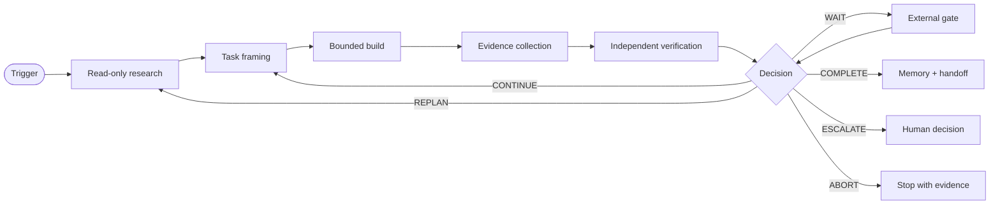

# Agentic Development Harness — Loop Engineering Pack
See the [Harness operator HOWTO](HOWTO.md) for reproducible operating commands.

## Why

AI agents can write code, but reliable software development requires more than code generation. A dependable harness must preserve intent, bound the work, produce reproducible evidence, maintain durable state, and stop or escalate when progress is no longer justified.

This pack makes that **loop explicit, auditable, interruptible, and repeatable** in Goose.

## What

This repository is a minimal Loop Engineering extension for Goose. It deliberately avoids reproducing a human organisation chart as a collection of agents.

The core loop uses three agents, each justified by a distinct execution property:

- **repository-researcher** — read-only exploration and evidence gathering;
- **change-builder** — bounded implementation with explicit scope;
- **independent-verifier** — verification separated from the agent that made the change.

Premium variants (`change-builder-premium`, `independent-verifier-premium`) activate on rework.
`error-analyzer` is summoned by `loop-breaker` on repeated tool failures; it is not part of the normal flow.

The orchestration itself is not represented as another persona. It is implemented through **recipes**, **skills**, **hooks**, persistent state, budgets, evidence, and explicit transition decisions.

## The loop

```text
Trigger → Research → Frame one bounded task → Build
  → Collect deterministic evidence → Verify independently
  → Persist state → Decide: CONTINUE | REPLAN | WAIT | COMPLETE | ESCALATE | ABORT
```


```mermaid
flowchart LR
    T([Trigger]) --> R[Read-only research]
    R --> F[Task framing]
    F --> B[Bounded build]
    B --> E[Evidence collection]
    E --> V[Independent verification]
    V --> D{Decision}
    D -->|CONTINUE| F
    D -->|REPLAN| R
    D -->|WAIT| W[External gate]
    W --> D
    D -->|COMPLETE| M[Memory + handoff]
    D -->|ESCALATE| H[Human decision]
    D -->|ABORT| A[Stop with evidence]
```

## Architecture

```text
Layer 4: LOOP CONTROL   State transitions, budgets, stagnation and stop conditions
Layer 3: RECIPES        Executable workflows and delegated phases
Layer 2: AGENTS         Isolated execution contexts with distinct permissions
Layer 1: SKILLS         Reusable methods and decision rules
Layer 0: GOOSE          Runtime, tools, sessions, extensions and subagents
```

| Mechanism      | Responsibility                                                                 |
|----------------|--------------------------------------------------------------------------------|
| **Agent**      | Isolated execution context with a specific permission or independence boundary |
| **Skill**      | Reusable method loaded when relevant                                           |
| **Recipe**     | Executable workflow and phase sequencing                                       |
| **Plugin**     | Distribution unit for hooks and support scripts                                |
| **Hook**       | Event-driven guard or trace action                                             |
| **Evidence**   | Deterministic proof produced by tests, linters, builds or inspections          |
| **State**      | Durable iteration status, decisions, budgets and evidence references           |
| **Controller** | Transition logic implemented by the loop recipe and loop-control skill         |

## Named agents (6)

Invoke with Goose Summon: `load agent <name>` or delegate into an isolated session.

| Agent | Role | Model |
|-------|------|-------|
| `change-builder` | Bounded implementation agent with explicit scope | claude-sonnet-4-6 |
| `change-builder-premium` | Premium builder invoked after 2+ rework cycles | gpt-5.6-sol |
| `independent-verifier` | Independent verification against acceptance criteria | claude-sonnet-4-6 |
| `independent-verifier-premium` | Premium verifier invoked after 2+ rework cycles | gpt-5.6-sol |
| `repository-researcher` | Read-only repository exploration and task framing | claude-sonnet-4-6 |
| `error-analyzer` | Summoned by loop-breaker on repeated tool failures | claude-sonnet-4-6 |

## Skills (13)

| Skill | Purpose |
|-------|---------|
| `task-framing` | Convert an engineering objective into the smallest independently verifiable Beads task contract |
| `evidence-verification` | Evaluate work against acceptance criteria using reproducible evidence |
| `loop-control` | Govern a Beads-backed engineering loop with budgets, dependencies, and transitions |
| `output-discipline` | Keep tool outputs within token budget |
| `interface-quality` | Shared quality floor for UI evaluation |
| `ui-design` | Visual design: token compliance, hierarchy, spacing |
| `ux-principles` | Journey completion, interaction state coverage |
| `domain-modeling` | External (mattpocock/skills) |
| `grill-me` | External (mattpocock/skills) |
| `grill-with-docs` | External (mattpocock/skills) |
| `grilling` | External (mattpocock/skills) |
| `skill-creator` | External (anthropics/skills) |
| `wcag-accessibility-audit` | External (mastepanoski/claude-skills) |

## Recipes

| Recipe | Purpose |
|--------|---------|
| `loop-engineering` | Full loop orchestrator (Trigger → Planner → Builder → Verifier → Controller) |
| `research` | Read-only repository research; returns a bounded task contract |
| `implement` | Claim one Beads task, delegate bounded writes, collect evidence |
| `verify` | Independent read-only verification with typed verdict |

## Installation

> **This is the top-level entry point.** Detailed steps are in [HOWTO.md](HOWTO.md) and [INSTALL.md](INSTALL.md).

```bash
# One-shot: build + assemble + verify release archive
just VERSION=1.0.0 release-pipeline

# Install into your user Goose config (~/.agents + ~/.config/goose)
just install-release

# Preview only (dry-run)
just INSTALL_FLAGS='--dry-run' install-release
```

See [docs/install-reference.md](docs/install-reference.md) for install flags and project-local targets.

## Quick start

```bash
# 1. Bootstrap the runtime from source
just bootstrap-runtime
just verify-runtime

# 2. Run the full loop
goose run --recipe loop-engineering \
  --params objective="Implement the requested change" \
  --params max_iterations=8

# 3. Run an isolated phase
goose run --recipe research \
  --params objective="Map the affected components"
```

## Validation

```bash
# Validate all recipes
find src/recipes -name '*.yaml' -print -exec goose recipe validate {} \;

# Validate runtime projection
just verify-runtime
```

## Decisions and stop conditions

Every iteration ends with exactly one typed decision:

| Decision   | Meaning |
|------------|---------|
| `CONTINUE` | A justified next bounded task exists |
| `REPLAN`   | Current assumptions or task decomposition are invalid |
| `WAIT`     | Progress depends on an external gate or event |
| `COMPLETE` | All acceptance criteria are supported by evidence |
| `ESCALATE` | A human decision, permission or risk acceptance is required |
| `ABORT`    | A budget, safety limit, impossibility or repeated stagnation |

The loop must stop or escalate when:
- all acceptance criteria are proven by evidence
- a maximum iteration, duration, or token budget is reached
- the same failure repeats without a materially different hypothesis
- no measurable progress occurs across consecutive iterations
- required evidence cannot be produced
- a destructive or privileged action requires approval
- constraints conflict or the objective is impossible under current conditions

*Completion must never be accepted solely because the builder reports that the work is done.*

## Loop state × Harness

| Step | Recipe | Agent | Skill |
|------|--------|-------|-------|
| 00 Trigger | `loop-engineering.yaml` (entry) | — | — |
| 01 Planner | `research.yaml` | `repository-researcher` | `task-framing` |
| 02 Builder | `implement.yaml` | `change-builder` | `task-framing` |
| 03 Verifier | `verify.yaml` | `independent-verifier` | `evidence-verification` |
| 04 Memory | inline | — | `loop-control` |
| 05 Manager | inline | — | `loop-control` |
| 06 Controller | `loop-engineering.yaml` | — | `loop-control` |

Memory and Manager run inline (no dedicated agents) to reduce latency and token cost.

## Integration with a larger harness

This pack can be merged into a broader Agentic Development Harness using Beads, SDD, TDD, a knowledge graph, CI gates, or organisation-specific skills.

Recommended mapping:

```text
Intent → Spec/AC → Beads task → Loop Engineering → Evidence → Memory/Handoff
```

- keep **Beads** as the durable work and dependency control plane
- keep specifications and acceptance criteria as the source of intent
- use core loop agents (researcher, builder, verifier) where isolation or independent verification is required
- express domain expertise through skills
- use recipes for orchestration
- keep deterministic verification outside the model whenever possible

## Design principles

1. **Few agents, strong boundaries.** Create an agent only when isolation, permissions, context, or independence justify it.
2. **Evidence over declarations.** Tests and reproducible commands establish completion.
3. **State outside conversation.** Durable decisions and progress must survive session compaction or restart.
4. **One bounded change per build iteration.** Reduce blast radius and simplify verification.
5. **Explicit terminal states.** Every loop must be able to complete, escalate, wait, or abort.
6. **Improve the loop deliberately.** Update skills, recipes, and guards only from observed evidence.

## Evaluation

The `src/app/eval-hub/` suite covers **4 agents, 7 skills, 4 recipes** (53 graded scenarios).
Component count is not a success metric — the preferred configuration is the smallest one that meets the quality gate and lies on the quality/cost Pareto frontier.

See [`src/app/eval-hub/evals/README.md`](src/app/eval-hub/evals/README.md).

## Release pipeline

```bash
just VERSION=1.0.0 release-pipeline   # bootstrap → assemble → verify
just VERSION=1.0.0 release-dryrun     # CI dry-run (reproducibility check)
just install-release                  # install to user config
just INSTALL_FLAGS='--dry-run' install-release   # preview
```

See [docs/harness-release-lifecycle.md](docs/harness-release-lifecycle.md) for the full reference.

## Development source vs runtime

Edit harness assets only under `src/agents`, `src/skills`, `src/recipes`, `src/plugins`, and `src/app`.
Root `.agents` and `.goose` are generated runtime projections — never edit them directly.

Bootstrap: `just bootstrap-runtime` · Verify: `just verify-runtime`
See [docs/migration/source-runtime-separation.md](docs/migration/source-runtime-separation.md).

## License

This pack is a local operational configuration. Adapt it to the governance, security, and delivery constraints of your project.
