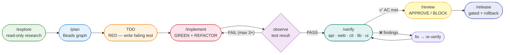

# 00 — Choosing a Harness Workflow

Use this chapter to choose the correct scenario playbook.

## Development workflow



> **Flowchart → table mapping:** `/explore` + `/plan` = discovery phase;
> `TDD` + `/implement` = implementation phase; `/verify` is embedded in `/release`.

## Mental model

The harness combines three layers:

1. **Goose runtime** — recipes, skills, extensions, subagents, sessions.
2. **Beads durable control plane** — issues, dependencies, claims, gates, memory, molecules/wisps.
3. **SDD method** — intent → spec → Beads graph → tests → implementation → review → verification.

## Decision table

> **Quick gate — which situation are you in?**
> - 🆕 Setting up a new repo for the first time → [Phase 1 — Setup](#phase-1--setup-once-per-project)
> - 🏗️ Building, implementing, or shipping a feature (most visits) → [Phase 2 — Feature lifecycle](#phase-2--feature-lifecycle-golden-path)
> - 🔍 Reviewing, operating, or maintaining → [Phase 3–6](#phase-3--review--quality)

⭐ = golden-path steps used on every feature.

---

### Phase 1 — Setup *(once per project)*

| Recipe | What you want to do |
|---|---|
| `/sdd` then `/plan` | Set this repo up for agentic development |

---

### Phase 2 — Feature lifecycle *(golden path)*

> **Start here.** Run all four steps in sequence for every feature.

| Recipe | What you want to do |
|---|---|
| ⭐ `/discover` | Start a new feature |
| ⭐ `/spec` | Write the spec |
| ⭐ `/implement` | Implement this bead |
| ⭐ `/release` | Prepare a release |

**Run it now:**

```bash
bd prime || true
bd ready --json || true

goose run --recipe dev --params task="<goal>" --params repo_path="$PWD" --params constraints="<optional constraints>"
```

---

### Phase 3 — Review & quality

| Recipe | What you want to do |
|---|---|
| `/review` | Review changes, audit security, or check test coverage |
| `/spec` then `/sdd` | Validate the spec |
| `/explore` then `/review` | Score this project |

> **`/review` modes:** pass `constraints="security"` for a security audit,
> `constraints="tests"` for test-coverage review, or omit for general code review.

---

### Phase 4 — Design & UX

| Recipe | What you want to do |
|---|---|
| `/design` then `/sdd` | Test UX with simulated users |
| `/design` then `/verify` | Review UI / check accessibility |

---

### Phase 5 — Operations

| Recipe | What you want to do |
|---|---|
| `/explore` then `/plan` | Investigate outage / flaky CI |
| `/dev` (mode=explore) | Research modules in parallel |

---

### Phase 6 — Maintenance

| Recipe | What you want to do |
|---|---|
| `/doc-review` | Improve docs / onboarding |
| `/remember` | Save a repo convention for future sessions |

---

## When to create Beads

Create or update Beads whenever the work is durable:

- feature or bug;
- discovered follow-up;
- decision requiring traceability;
- async wait/gate;
- cross-session handoff;
- release or incident action.

Do **not** use markdown TODOs as durable task tracking.

## When to delegate

Delegate to subagents when:

- the work is read-only and parallelizable;
- a specialist role helps, e.g. `review-critic`, `ux-researcher`, or `ui-designer`;
- you want to preserve the main context;
- you need independent critique.

Do not delegate overlapping write scopes.

---

## Ready? Copy and run

```bash
goose run --recipe dev --params task="<goal>" --params repo_path="$PWD" --params constraints="<optional constraints>"
```
