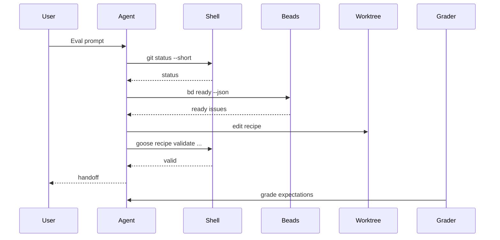

# 16 — Evaluation Analysis Workflow

## Purpose

Runtime skill evaluations answer whether a skill changes behavior. Deep evaluation analysis answers why a result happened.

Use this workflow when A/B results are counter-intuitive, noisy, or blocked by max-turn exhaustion, for example:

- `with_skill` scores lower than `without_skill`;
- both configurations tie;
- a run passes but reaches `max_turns`;
- feedback points to runner, grader, scenario, or audit visibility issues;
- a scenario appears coherent but the observed behavior contradicts the expected skill value.

## Inputs

For each evaluated subject:

```text
dist/evals/<kind>/<subject>/<content-hash>/
```

For skill evaluations today:

```text
dist/evals/skills/<skill-name>/<content-hash>/
```

Use these artifacts:

```text
benchmark.json
benchmark.md
review.html
eval-N/eval_metadata.json
eval-N/<configuration>/run-M/outputs/events.jsonl
eval-N/<configuration>/run-M/outputs/response.md
eval-N/<configuration>/run-M/audit.json
eval-N/<configuration>/run-M/feedback.json
eval-N/<configuration>/run-M/grading.json
eval-N/<configuration>/run-M/timing.json
```

Also load:

```text
evals/skills/<skill-name>.json
.agents/skills/<skill-name>/SKILL.md
dist/evals/evaluation.db
```

## Analysis levels

Analyze at three levels:

1. **Run analysis** — one `(eval_id, configuration, run_number)`.
2. **Scenario comparison** — compare `with_skill` vs `without_skill` for one `eval_id`.
3. **Subject summary** — aggregate all scenarios for one skill, agent, or recipe.

## Data model

### Run analysis

```json
{
  "run_id": "content hash or git hash",
  "kind": "skills",
  "subject": "code-review",
  "eval_id": 0,
  "configuration": "with_skill",
  "run_number": 1,
  "score": {
    "pass_rate": 0.75,
    "passed": 3,
    "failed": 1
  },
  "turns": {
    "used": 12,
    "max": 50,
    "reached_max": false
  },
  "audit": {
    "tool_calls": [],
    "commands": [],
    "validations": [],
    "beads_actions": [],
    "files_changed": []
  },
  "bad_actions": [],
  "blockages": [],
  "root_causes": [],
  "confidence": 0.0
}
```

### Scenario analysis

```json
{
  "subject": "code-review",
  "eval_id": 0,
  "skill_impact": "positive|neutral|negative|inconclusive",
  "scenario_quality": "good|too_easy|too_broad|too_strict|contaminated|fixture_needed|grader_issue|runner_issue",
  "with_skill": {},
  "without_skill": {},
  "delta": 0.25,
  "root_causes": [],
  "recommendations": {
    "skill": [],
    "scenario": [],
    "runner": [],
    "grader": []
  }
}
```

### Subject summary

```json
{
  "kind": "skills",
  "subject": "code-review",
  "content_hash": "...",
  "summary": "...",
  "scenario_matrix": [],
  "recurring_bad_actions": [],
  "recurring_root_causes": [],
  "top_recommendations": []
}
```

## Root-cause taxonomy

Use multiple root causes when needed.

| Root cause | Meaning |
| --- | --- |
| `skill_gap` | The skill does not instruct the expected behavior clearly enough. |
| `scenario_too_easy` | The baseline can pass from the prompt or repository context alone. |
| `scenario_too_broad` | The scenario asks for too many phases in one run. |
| `scenario_too_strict` | The grader expects an overly specific form rather than equivalent behavior. |
| `baseline_contamination` | The baseline sees equivalent method guidance through files such as `AGENTS.md` or `.agents/skills/`. |
| `fixture_issue` | The scenario depends on missing, unstable, or ambiguous fixture state. |
| `grader_issue` | The grader misses evidence or grades behavior inconsistently. |
| `runner_audit_issue` | The runner fails to capture tool, Beads, browser, or file-change evidence. |
| `turn_budget_issue` | The run reaches or nearly reaches `max_turns`. |
| `tool_error_loop` | The agent spends turns retrying failed tools. |
| `validation_loop` | The agent repeatedly edits/validates without converging. |
| `beads_state_confusion` | The agent cannot identify, claim, update, or close durable Beads state correctly. |
| `browser_setup_failure` | Browser/server setup prevents UI evidence collection. |
| `over_exploration` | The agent inspects broadly after enough evidence exists. |
| `final_answer_omitted` | Required handoff/verdict/report is missing despite useful work. |
| `model_variance` | Difference is plausible random model variance; rerun needed. |

## Bad-action taxonomy

Classify concrete observable actions.

| Bad action | Detection signal |
| --- | --- |
| `durable_edit_before_beads` | File changes before `bd create`, `bd update --claim`, or explicit no-Beads justification. |
| `read_only_write` | Files changed or Beads mutation in a read-only scenario. |
| `missing_validation` | Changed files but no relevant validation command. |
| `missing_handoff` | No final report with files changed, validation, status, and risks. |
| `markdown_todo_tracking` | `TODO.md`, markdown checklist, or similar durable tracking instead of Beads. |
| `memory_misuse` | Long content, task, or secret stored in memory. |
| `dependency_direction_error` | Beads dependency direction contradicts `B needs A`. |
| `overlapping_delegation` | Multiple workers can write the same file/module. |
| `missing_delegation_contract` | Delegation lacks scope, permissions, validation, or output format. |
| `browser_claim_without_evidence` | UI claim without browser/tool, viewport, screenshot, console, or network evidence. |
| `validation_loop` | Similar validation command fails repeatedly. |
| `tool_error_loop` | Similar failing tool command repeats. |
| `max_turn_exhaustion` | `max_turns_reached = true`. |

## Timeline reconstruction

Build a normalized timeline from `events.jsonl` and `audit.json`:

```json
[
  {"step": 1, "actor": "assistant", "type": "tool_request", "tool": "shell", "classification": "inspection"},
  {"step": 2, "actor": "tool", "type": "tool_response", "exit_code": 0},
  {"step": 3, "actor": "assistant", "type": "message", "classification": "handoff"}
]
```

Recommended classifications:

```text
orientation
inspection
planning
beads_read
beads_write
file_read
file_write
validation
browser_action
delegation
handoff
irrelevant_exploration
error_recovery
loop
final_answer
```

## Sequence diagrams

Generate Mermaid sequence diagrams per run:

```text
eval-N/<configuration>/run-M/sequence.mmd
```

Example:



A good diagram should make these failures obvious:

- repeated tool loops;
- validation loops;
- file write before Beads claim/create;
- read-only write;
- missing final answer;
- max-turn exhaustion;
- broad exploration after expectations are already satisfied.

## Comparative scenario analysis

For each scenario compare `with_skill` and `without_skill`:

```markdown
## <subject> eval-N

### Score
- with_skill: ...
- without_skill: ...
- delta: ...

### Behavior differences
- with_skill actions, strengths, failures
- without_skill actions, strengths, failures

### Root cause
- skill_gap / scenario_too_easy / runner_audit_issue / ...

### Recommendation
- skill changes
- scenario changes
- runner/grader changes
```

Use this interpretation matrix:

| Result | Likely analysis priority |
| --- | --- |
| `with_skill > without_skill` and no max hit | Skill signal likely valid. |
| `with_skill > without_skill` but max hit | Skill signal positive but efficiency/stop rules need review. |
| `with_skill == without_skill` | Scenario may be too easy, contaminated, or skill may not add value. |
| `with_skill < without_skill` | Prioritize root-cause analysis before editing skill. |
| Both max hit | Treat score as low-confidence until timeline explains saturation. |

## SQLite persistence

Current tables:

```text
eval_runs
eval_run_results
eval_improvements
eval_feedback
```

Add later:

```sql
CREATE TABLE eval_analysis (
  id INTEGER PRIMARY KEY AUTOINCREMENT,
  run_id TEXT NOT NULL,
  kind TEXT NOT NULL,
  subject TEXT NOT NULL,
  eval_id INTEGER,
  configuration TEXT,
  run_number INTEGER,
  skill_impact TEXT,
  scenario_quality TEXT,
  root_causes_json TEXT,
  bad_actions_json TEXT,
  blockages_json TEXT,
  confidence REAL,
  analysis_path TEXT,
  sequence_path TEXT,
  created_at TEXT NOT NULL
);
```

And scenario-level comparison:

```sql
CREATE TABLE eval_scenario_analysis (
  id INTEGER PRIMARY KEY AUTOINCREMENT,
  run_id TEXT NOT NULL,
  kind TEXT NOT NULL,
  subject TEXT NOT NULL,
  eval_id INTEGER NOT NULL,
  with_score REAL,
  without_score REAL,
  delta REAL,
  with_turns REAL,
  without_turns REAL,
  root_cause TEXT,
  skill_impact TEXT,
  scenario_quality TEXT,
  recommended_action TEXT,
  created_at TEXT NOT NULL
);
```

## Automation workflow

Implement:

```bash
python scripts/analyze-skill-eval-results.py \
  --workspace-root dist/evals/skills \
  --db dist/evals/evaluation.db
```

Useful filters:

```bash
--skill code-review
--hash <content-hash>
--scenario eval-0
--no-llm
--write-html
--write-mermaid
```

Pipeline:

```text
load benchmark
load eval definitions
load run artifacts
reconstruct timeline
classify actions
detect bad actions
detect blockages
compare with_skill vs without_skill
classify root cause
write analysis.md/json
write sequence.mmd
update SQLite
```

## Beads replay mechanism

Use **Beads formulas + molecules/wisps** to replay the same analysis over every scenario.

Recommended reusable workflows:

```text
eval-scenario-analysis
  input: kind, subject, hash, eval_id
  output: scenario analysis + sequence diagrams

eval-skill-analysis
  input: kind, subject, hash
  output: all scenario analyses + skill summary

eval-suite-analysis
  input: kind, workspace_root
  output: all skill summaries + suite analysis index
```

Use durable molecules when the analysis itself is work to track:

```bash
bd mol pour eval-skill-analysis --var subject=beads-harness --var hash=<hash>
```

Use ephemeral wisps for fan-out over many scenarios:

```bash
bd mol wisp eval-scenario-analysis --var subject=beads-harness --var eval_id=0 --var hash=<hash>
```

Then persist only the digest:

```bash
bd mol squash <wisp-id> --summary "scenario analysis digest"
```

## Done criteria for deep analysis

A deep evaluation analysis is complete when it produces:

- `analysis-summary.md` for the suite;
- `analysis.md` and `analysis.json` for each subject;
- `sequence.mmd` for each run;
- root-cause and bad-action classifications;
- SQLite rows for run-level and scenario-level analysis;
- Beads follow-ups for skill, scenario, runner, or grader changes.
