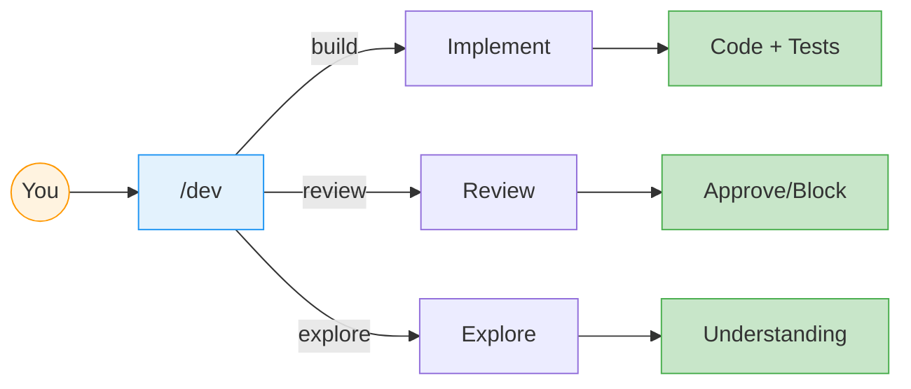

# Agentic Development Harness



## Install

```bash
./scripts/install.sh
```

## Use

```bash
goose run dev
```

Describe what you want. The system handles the rest.

---

## Want More Control?

| I want to...     | Command                |
|------------------|------------------------|
| Build a feature  | `/dev` or `/implement` |
| Write a spec     | `/spec`                |
| Plan tasks       | `/plan`                |
| Review code      | `/review`              |
| Explore codebase | `/explore`             |

---

📖 **[Tutorials](tutorials/)** — Learn by doing  
📚 **[Reference](reference/)** — Detailed documentation  
🔧 **[Internal](internal/)** — For contributors
