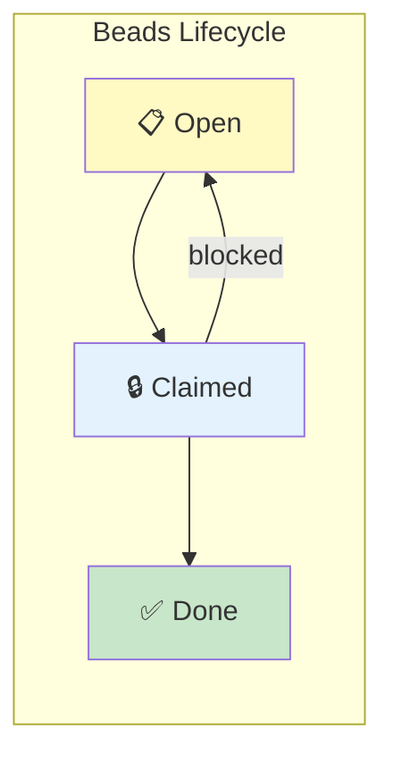
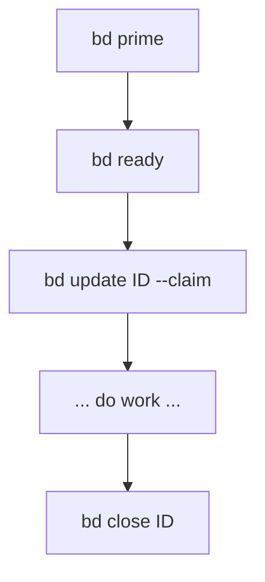
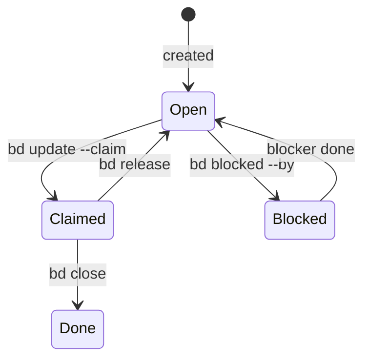

# Concept: Beads Workflow

**Beads** — A durable task graph that survives session restarts.



## Why Beads?

| Without Beads | With Beads |
|---------------|------------|
| Tasks in chat (lost on restart) | Tasks in durable graph |
| No dependencies | Clear blockers |
| "What's next?" | `bd ready` shows it |
| Parallel work collides | One owner per bead |

## Core Commands



| Command | Purpose |
|---------|---------|
| `bd prime` | Load project context |
| `bd ready --json` | See claimable work |
| `bd update <id> --claim` | Take ownership |
| `bd close <id>` | Mark complete |
| `bd blocked <id> --by <other>` | Declare dependency |

## Bead States



## Example Session

```bash
# 1. See what's ready
$ bd ready --json
[
  { "id": "AUTH-01", "title": "Implement login endpoint", "status": "open" },
  { "id": "AUTH-02", "title": "Add password hashing", "status": "blocked_by: AUTH-01" }
]

# 2. Claim a task
$ bd update AUTH-01 --claim

# 3. Do the work...

# 4. Mark done
$ bd close AUTH-01
# AUTH-02 is now unblocked and ready
```

## Rules

1. **Claim before writing** — No code without a claimed bead
2. **One owner** — Each bead has one assignee
3. **Close when done** — Don't leave beads claimed indefinitely
4. **Dependencies matter** — Blocked beads auto-unblock when blockers close

---

**See also:** [SDD Loop](sdd-loop.md)
