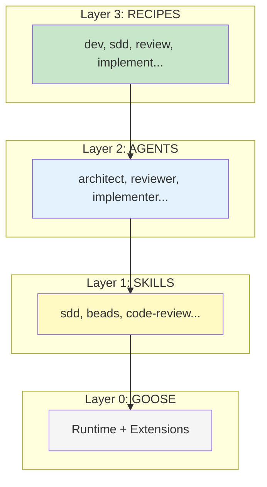
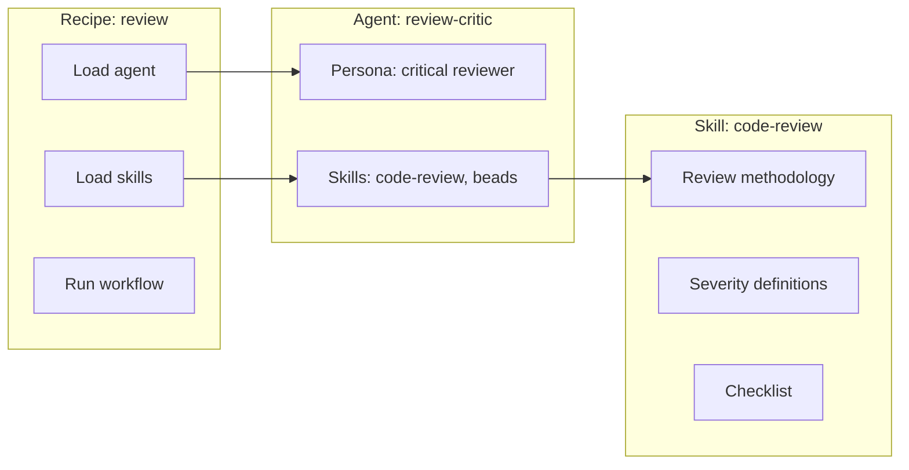

# Concept: Layers

The harness uses a **three-layer architecture**. Each layer adds value on top of the one below.



## What Each Layer Does

| Layer | Contains | Purpose |
|-------|----------|---------|
| **Skills** | Methodology text | Inject expertise (how to review, how to design) |
| **Agents** | Persona + skills | Specialist identity (reviewer, architect) |
| **Recipes** | Workflow + agents | Orchestration (which agents, in what order) |

## Example: Code Review



When you run `/review`:
1. Recipe loads the `code-review` skill
2. Recipe loads the `review-critic` agent
3. Agent uses skill methodology to review code
4. Recipe structures the output

## Layer Delta

Each layer should add **measurable value** over the one below:

```
Recipe alone      vs  Recipe + Agents        → Better quality?
Agent + Skills    vs  Skills alone           → Better judgment?
Skills alone      vs  Nothing                → Better methodology?
```

This is how we evaluate if a layer is worth keeping.

## When to Use What

| Situation | Use |
|-----------|-----|
| Quick task, no special expertise | Just Goose (Layer 0) |
| Need specific methodology | Load a skill (Layer 1) |
| Need consistent persona | Load an agent (Layer 2) |
| Need orchestrated workflow | Run a recipe (Layer 3) |

## Practical Access

```bash
# Layer 3: Run a recipe
goose run dev

# Layer 2: Load an agent directly
load agent architect

# Layer 1: Load a skill directly  
load skills code-review

# Layer 0: Just talk to Goose
goose session
```

---

**See also:** [SDD Loop](sdd-loop.md) · [Beads Workflow](beads-workflow.md)
