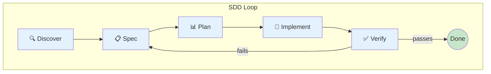

# Concept: SDD Loop

**Spec-Driven Development** — Every feature starts with a spec, not code.



## Why SDD?

| Without SDD | With SDD |
|-------------|----------|
| "Add login" → code → bugs → rewrite | "Add login" → spec → code → works |
| Scope creep | Clear boundaries |
| "Is it done?" | Acceptance criteria say yes/no |

## The Phases

### 1. Discover
```
Input:  Vague idea ("users should log in")
Output: PRD with problem statement, goals, non-goals
```

### 2. Spec
```
Input:  PRD
Output: .specs/features/*/spec.md with:
        - Context
        - Acceptance Criteria (WHEN/THEN format)
        - Constraints
```

### 3. Plan
```
Input:  Spec
Output: Beads task graph (claimable units of work)
```

### 4. Implement
```
Input:  Claimed bead
Output: Code + tests that satisfy the AC
```

### 5. Verify
```
Input:  Implementation
Output: Evidence that ACs pass
```

## Spec Format

```markdown
# Spec: Feature Name

> Status: Active
> Scope: feat-name

## Context
What this is and why it exists.

## Acceptance Criteria

### [FEAT-01] — User can log in
WHEN user submits valid credentials
THEN session is created
AND user is redirected to dashboard
```

## Run the Full Loop

```bash
goose run sdd
```

Or phase by phase:
```
/discover → /spec → /plan → /implement → /verify
```

---

**See also:** [Beads Workflow](beads-workflow.md)
