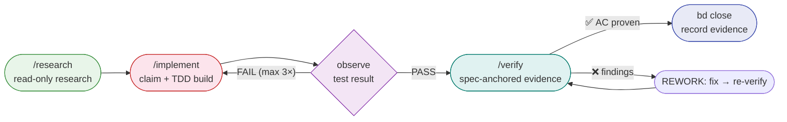

# 00 — Choosing a Harness Workflow

Use this chapter to choose the correct scenario playbook.

## Development workflow



> **Canonical sequence:** `/research` (research + task framing) → `bd` (claim task) → `/implement` (TDD build) → `/verify` (independent evidence). The `/loop-engineering` recipe orchestrates the full sequence automatically.

## Mental model

The harness combines three layers:

1. **Goose runtime** — recipes, skills, extensions, subagents, sessions.
2. **Beads durable control plane** — issues, dependencies, claims, gates, memory, molecules/wisps.
3. **SDD method** — intent → research → Beads graph → tests → implementation → verification → release.

## Decision table

> **Quick gate — which situation are you in?**
> - 🆕 Setting up a new repo for the first time → [Phase 1 — Setup](#phase-1--setup-once-per-project)
> - 🏗️ Building, implementing, or shipping a feature (most visits) → [Phase 2 — Feature lifecycle](#phase-2--feature-lifecycle-golden-path)
> - 🔍 Reviewing, operating, or maintaining → [Phase 3–6](#phase-3--review--quality)

⭐ = golden-path steps used on every feature.

---

### Phase 1 — Setup *(once per project)*

```bash
# Clone and install harness
git clone <repo> && cd agentic-devlopment
./scripts/install.sh

# Verify: active recipes
ls .goose/recipes/    # implement  loop-engineering  research  verify
```

---

### Phase 2 — Feature lifecycle *(golden path)*

> **Start here.** Run all four steps in sequence for every feature.

| Step | Command | What you want to do |
|---|---|---|
| ⭐ 1 | `goose recipe run research` | Frame the task, read context |
| ⭐ 2 | `bd ready` then `bd update <id> --claim` | Claim the Beads task |
| ⭐ 3 | `goose recipe run implement` | TDD implementation |
| ⭐ 4 | `goose recipe run verify` | Independent spec-anchored verification |

**Or run the full orchestrated loop:**

```bash
bd prime           # load context and see ready work
goose recipe run loop-engineering   # research → build → verify → control
```

#### Status signals

| Step | Success signal |
|------|---------------|
| `bd prime` | prints workflow context (no error) |
| `bd ready` | lists ≥1 issue without "Error:" |
| `bd update <id> --claim` | "✓ Updated issue: ..." |
| `goose recipe run implement` | session completes, test suite green |
| `goose recipe run verify` | "ACCEPTED" verdict in Beads note |
| `bd close <id>` | "✓ Closed issue: ..." |

#### Recovery

| Failure | Action |
|---------|--------|
| `bd prime` fails | Check Beads DB exists: `ls .beads/*.db` |
| `bd update --claim` fails | Another agent holds it; wait or run `bd show <id>` |
| 3 REWORK cycles reached | Set state to ESCALATE, stop, create a Beads note: `bd note <id> "ESCALATE: <reason>"` |

**Terminal escalation:** run `bd note <id> "ESCALATE: <reason>"` then stop — do not attempt further retries.

---

### Phase 3 — Review & quality

| Recipe | What you want to do |
|---|---|
| `goose recipe run verify` | Review changes and verify against spec ACs |
| `goose recipe run research` | Read-only investigation: security, coverage, scoring |

---

### Phase 4 — Design & UX

| Command | What you want to do |
|---|---|
| `goose recipe run research` then `goose recipe run implement` | UX research → implementation |
| `goose recipe run verify` | Review UI / check accessibility |

---

### Phase 5 — Operations

| Command | What you want to do |
|---|---|
| `goose recipe run research` | Investigate outage / flaky CI |
| `goose recipe run loop-engineering` | Full governed loop: research modules in parallel |

---

### Phase 6 — Maintenance

| Command | What you want to do |
|---|---|
| `goose recipe run research` | Improve docs / onboarding investigation |
| `bd remember "<insight>"` | Save a repo convention for future sessions |

---

## When to create Beads

Create or update Beads whenever the work is durable:

- feature or bug;
- discovered follow-up;
- decision requiring traceability;
- async wait/gate;
- cross-session handoff;
- release or incident action.

Do **not** use markdown TODOs as durable task tracking.

## When to delegate

Delegate to subagents when:

- the work is read-only and parallelizable;
- a specialist role helps, e.g. `review-critic`, `ux-researcher`, or `ui-designer`;
- you want to preserve the main context;
- you need independent critique.

Do not delegate overlapping write scopes.

---

## Ready? Copy and run

```bash
bd prime                            # load context, confirm DB is healthy
bd ready                            # list claimable issues
bd update <id> --claim              # claim your task
goose recipe run implement          # TDD build
goose recipe run verify             # independent verification
bd close <id>                       # record evidence and close
```
