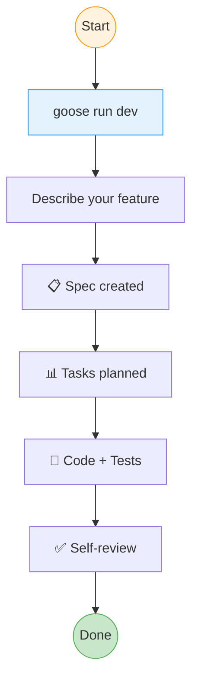
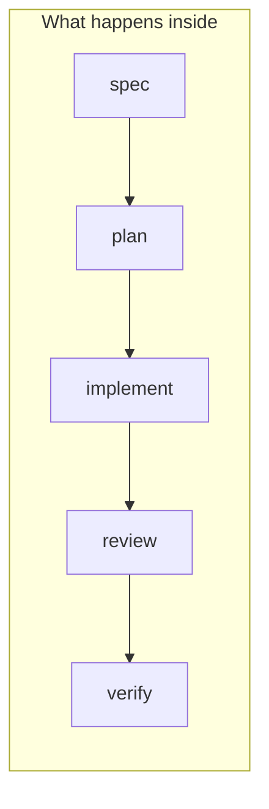

# Tutorial: Build a Feature



## Step 1: Start

```bash
goose run dev
```

## Step 2: Describe What You Want

```
> Add user authentication with email/password login
```

Be specific. Include:
- What the feature does
- Any constraints or preferences
- Where it should live in the codebase

## Step 3: Watch the System Work



The system automatically:

| Phase | What happens | Artifact |
|-------|--------------|----------|
| **spec** | Defines acceptance criteria | `.specs/features/*/spec.md` |
| **plan** | Breaks into tasks | Beads task graph |
| **implement** | Writes code + tests | Source files |
| **review** | Checks quality | Approval/feedback |
| **verify** | Runs tests | Evidence |

## Step 4: Review the Result

When complete, you'll have:
- ✅ Spec with testable acceptance criteria
- ✅ Implementation with tests
- ✅ Review verdict

## Tips

- **Too big?** Break your request into smaller features
- **Wrong direction?** Interrupt and clarify
- **Want control?** Use `/implement` to work on a specific task

---

**Next:** [Review Code →](02-review-code.md)
