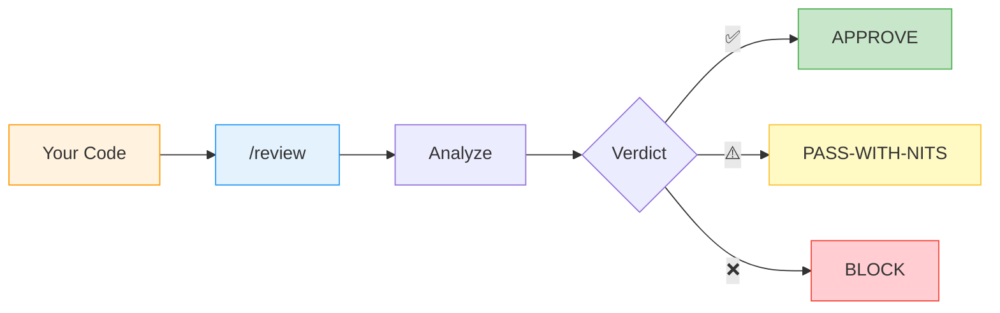
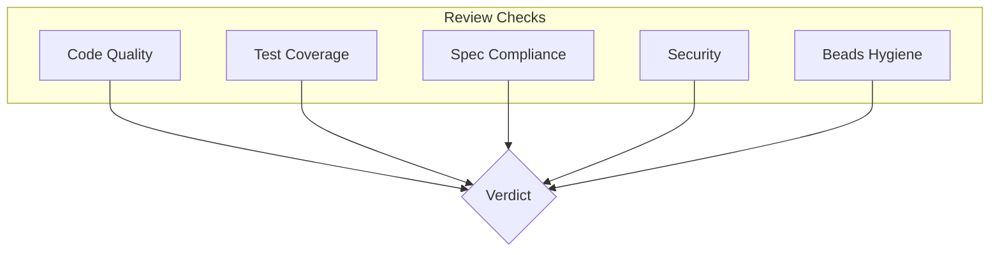

# Tutorial: Review Code



## Step 1: Start Review

```bash
goose run review
```

Or in an existing session:
```
/review
```

## Step 2: Specify What to Review

```
> Review the authentication module I just added
```

Or be specific:
```
> Review src/auth/*.ts against the spec in .specs/features/auth/spec.md
```

## Step 3: Understand the Verdict



| Verdict | Meaning | Action |
|---------|---------|--------|
| **APPROVE** | Ready to merge | Proceed |
| **PASS-WITH-NITS** | Minor issues | Fix or ignore |
| **BLOCK** | Serious issues | Must fix |

## Step 4: Address Findings

Each finding includes:
- **Severity:** CRITICAL / HIGH / MEDIUM / LOW
- **Location:** File and line
- **Issue:** What's wrong
- **Suggestion:** How to fix

## Review Scopes

| Scope | Command | What's checked |
|-------|---------|----------------|
| Code only | `/review scope=code` | Logic, style, tests |
| Docs only | `/review scope=docs` | Documentation quality |
| Full | `/review scope=full` | Everything |

---

**Next:** [Explore Codebase →](03-explore-codebase.md)
