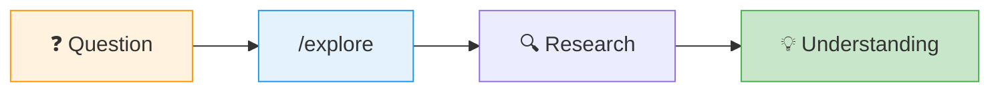
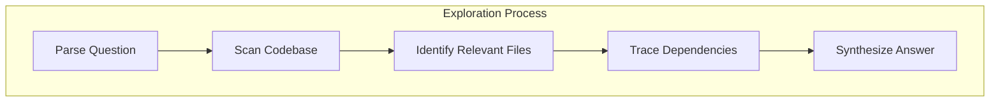

# Tutorial: Explore a Codebase



## Step 1: Start Exploration

```bash
goose run explore
```

Or in an existing session:
```
/explore
```

## Step 2: Ask Your Question

```
> How does the authentication flow work?
```

```
> Where is the database connection configured?
```

```
> What would I need to change to add OAuth support?
```

## Step 3: Get a Structured Answer



The explorer will:

| Action | Result |
|--------|--------|
| **Map structure** | File tree + entry points |
| **Trace flows** | Call graphs + data flow |
| **Find patterns** | Similar code, conventions |
| **Summarize** | Plain-language explanation |

## Read-Only Guarantee

```
⚠️ /explore NEVER modifies files
```

Safe for:
- Production codebases
- Unfamiliar repositories
- Learning sessions

## Example Questions

| Type | Example |
|------|---------|
| **Architecture** | "What's the overall structure of this project?" |
| **Flow** | "How does a request go from API to database?" |
| **Location** | "Where is user validation implemented?" |
| **Impact** | "What would break if I changed X?" |
| **History** | "Why is this code structured this way?" |

## Pro Tips

1. **Be specific** — "How does auth work?" vs "How does JWT refresh work in auth/tokens.ts?"
2. **Chain questions** — Start broad, then narrow down
3. **Save insights** — Use `bd remember` to store important findings

---

**Back to:** [Start Here](../START-HERE.md)
