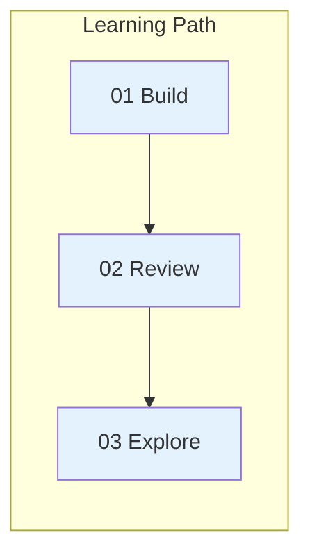

# Tutorials

Visual, step-by-step guides to common workflows.

| Tutorial | Time | You'll Learn |
|----------|------|--------------|
| [Build a Feature](01-build-feature.md) | 5 min | Full dev workflow |
| [Review Code](02-review-code.md) | 3 min | Quality gates |
| [Explore Codebase](03-explore-codebase.md) | 3 min | Safe research |

---

**Ready for more?** See [Concepts](../concepts/) or [Reference](../reference/)
